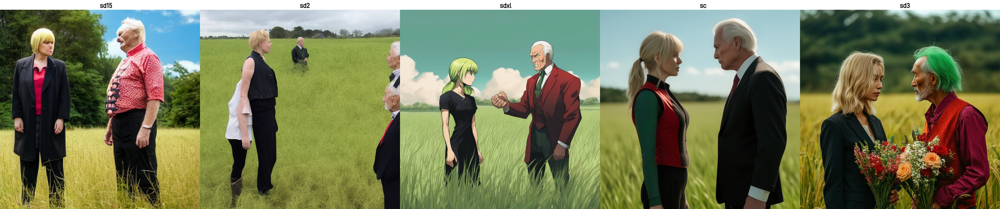
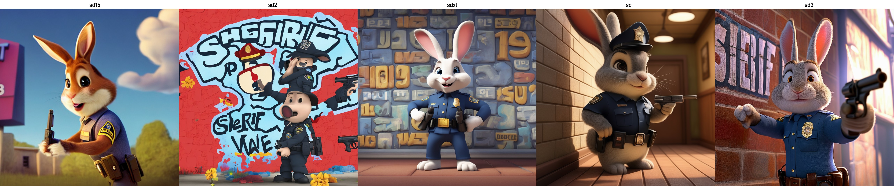
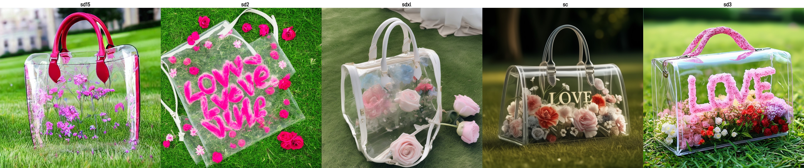
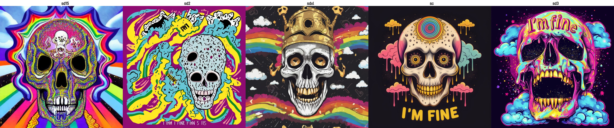
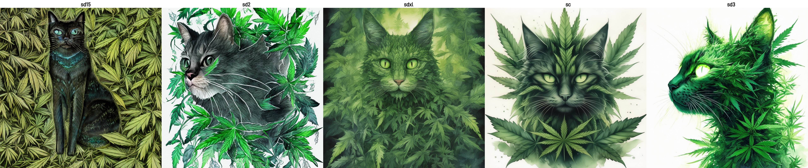
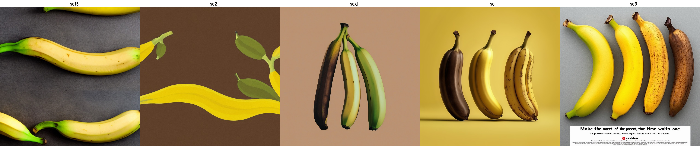
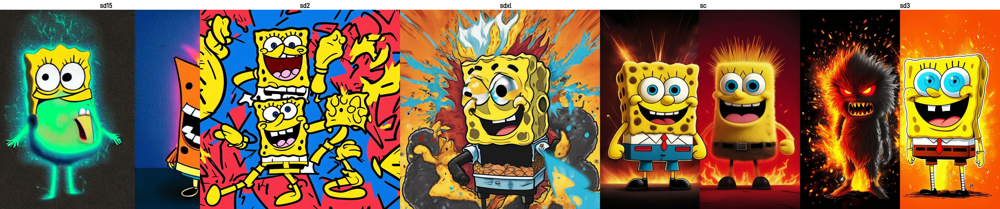

# Stable Diffusion Simple Review (SD15 - SD3)

---

```
A woman with blond hair and a black suit stands on the left of the frame, and an elderly man with green hair and a red sleeved vest, full of muscles, stands on the right. The two of them were facing off, looking at each other from a long distance. In the field scene, the grass, the sky, and the rice are floating in the foreground. Film composition, long shot, pan shot, tilt shot, ultra wide Angle lens, game cg. Two bouquets of flowers block in front of the camera, with the background blurred and in close focus
```



---

```
A rabbit in a police uniform, holding a turnish-shaped gun, points at a wall. The word "Sheriff" was painted in large letters on the wall. 32k ultra HD photos, high detail, rendered in Pixar's signature style, vibrant colors, laugh filled atmosphere, Pixar style, visually stunning and emotionally appealing
```



---


```
There is a transparent and exquisite luxury bag on the grass, which contains various expensive and exquisite flowers. The flowers form a cute word "LOVE"
```



---

```
A striking and surreal vector design featuring a crying skull adorned with gold teeth, rainbows, clouds, glitter, and psychedelic colors. The skull's eyes are filled with tears, and its mouth is open in a howl, while the text "I'm fine" is written across its forehead. The overall design is dark and morbid with a touch of humor and a dash of unexpected color and glitter, creating a unique and unforgettable visual experience.
```



---

```
A captivating watercolor illustration presents a mesmerizing cat-like creature entirely composed of green cannabis leaves. The first-person perspective draws the viewer into its haunting world, immersing them in a supernatural realm filled with dark fantasy elements. The creature's glowing eyes emit an eerie light, inviting exploration into the unknown. The delicate coloring and side view of the subject showcase its delicate beauty and enigmatic allure. The artistic influences of dark fantasy, the painting style of Quentin Blake, and the creative genius of Damien Hirst harmoniously converge to create this extraordinary masterpiece., photo, illustration
```



---

```
A powerful visual metaphor featuring a sequence of four bananas, each transitioning seamlessly from fresh yellow to dark brown. The journey begins with a vibrant, slightly green banana on the left, moving through a yellowing banana with a hint of brown, a banana with a predominantly brownish-yellow hue, and finally to a dark brown, overripe banana on the right. The message beneath them, written in large, bold text, reads 'Make the most of the present moment; time waits for no one.' The dark grey background emphasizes the vibrant colors of the bananas and the stark contrast between them, creating a striking and thought-provoking visual statement., typography
```



---

```
A striking duality illustration featuring SpongeBob SquarePants in two contrasting expressions. On the left, a fierce SpongeBob sports a darker fur coat, red eyes, and a menacing grin, surrounded by a fiery orange and black background with sparks flying. On the right, a cheerful SpongeBob appears in a bright yellow fur coat, blue eyes, and a contagious smile, against a serene blue background that contrasts sharply with the left side. A lightning bolt connects these two opposing natures, emphasizing the duality of SpongeBob's character.
```



---
